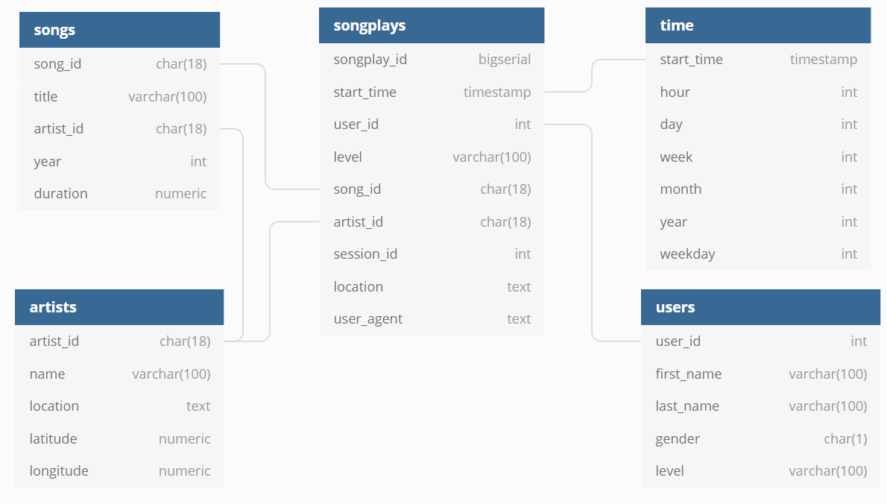

# Sparkify database modelling

## Introduction

A startup called Sparkify want to analyze the data they have been collecting on songs and user activity on their new music streaming app. The analytics team is particularly interested in understanding what songs users are listening to.

The aim is to create a Postgres Database Schema and ETL pipeline to optimize queries for song play analysis.

In this project, I have to model data with Postgres and build and ETL pipeline using Python. On the database side, I have to define fact and dimension tables for a Star Schema for a specific focus. On the other hand, ETL pipeline would transfer data from files located in two local directories into these tables in Postgres using Python and SQL

<b>Schema for Song Play Analysis</b>

<b>Fact Table</b>

<b> songplays </b> records in log data associated with song plays

<b>Dimension Tables</b>

<b> users </b> in the app

<b> songs </b> in music database

<b> artists </b> in music database

<b> time: </b> timestamps of records in songplays broken down into specific units

<b>Project Design</b>

Database Design is very optimized because with a ew number of tables and doing specific join, we can get the most information and do analysis

ETL Design is also simplified have to read json files and parse accordingly to store the tables into specific columns and proper formatting

<b>Database Script</b>

Writing "python create_tables.py" command in terminal, it is easier to create and recreate tables

<b>Jupyter Notebook</b>

etl.ipynb, a Jupyter notebook is given for verifying each command and data as well and then using those statements and copying into etl.py and running it into terminal using "python etl.py" and then running test.ipynb to see whether data has been loaded in all the tables

## Relevant Files Provided

<b>test.ipnb </b>displays the first few rows of each table to let you check your database

<b>create_tables.py </b>drops and created your table

<b>sql_queries.py </b>containg all your sql queries and in imported into the last three files above

<b>etl.py </b> containing etl pipelines to extract data from json and store the data in Postgres database